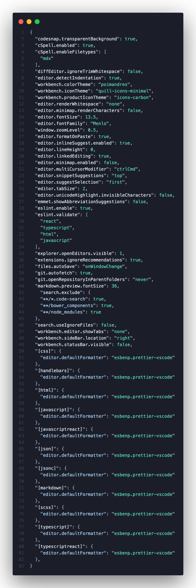

# VS Code Settings

# Font

* [Menlo](https://en.wikipedia.org/wiki/Menlo_(typeface))


## Themes/Color

* [Poimandres](https://marketplace.visualstudio.com/items?itemName=pmndrs.pmndrs)
  * Poimandres is a minimal, frameless dark-theme

## Extensions

* Theme / Editor Experience
    * [Quill Icons](https://marketplace.visualstudio.com/items?itemName=cdonohue.quill-icons)
        * A light/dark low contrast file icon set for many different file types
    * [Carbon Product Icons](https://marketplace.visualstudio.com/items?itemName=antfu.icons-carbon)
        * A light/dark low contrast product icon set
    * [ESLint](https://marketplace.visualstudio.com/items?itemName=dbaeumer.vscode-eslint)
        * Integrates ESLint JS
    * [Prettier](https://marketplace.visualstudio.com/items?itemName=esbenp.prettier-vscode)
        * Automatically format javascript, JSON, CSS, Sass
    * [Paste JSON as Code](https://marketplace.visualstudio.com/items?itemName=quicktype.quicktype)
        * Auto generate TypeScript (and other languages) types from JSON data., and HTML files.
    * [PostCSS Intellisense and Highlighting](https://marketplace.visualstudio.com/items?itemName=vunguyentuan.vscode-postcss)
        * Works better than the other more popular one of a similar name.
    * [Code Spell Checker](https://marketplace.visualstudio.com/items?itemName=streetsidesoftware.code-spell-checker)
        * Spell check markdown, comments and variable names.
    * [Pretty TypeScript Errors](https://marketplace.visualstudio.com/items?itemName=yoavbls.pretty-ts-errors)
        * Makes TS errors more human readable.
* Useful Tools 
    * [Paste JSON as Code](https://marketplace.visualstudio.com/items?itemName=quicktype.quicktype)
        * Auto generate TypeScript (and other languages) types from JSON data.
    * [Code Snap](https://marketplace.visualstudio.com/items?itemName=adpyke.codesnap)
        * Take pictures of code with your VS Code Theme / Font settings.
* Languages and Libraries
  * [XML Tools](https://marketplace.visualstudio.com/items?itemName=DotJoshJohnson.xml)
    * XML Formatting, XQuery, and XPath Tools for Visual Studio Code.
  * [Tailwind CSS IntelliSense](https://marketplace.visualstudio.com/items?itemName=bradlc.vscode-tailwindcss)
    * Intelligent Tailwind CSS tooling for VS Code.
  * React
    * [ES7+ React/Redux/React-Native snippets](https://marketplace.visualstudio.com/items?itemName=dsznajder.es7-react-js-snippets)
      * Extensions for React, React-Native and Redux in JS/TS with ES7+ syntax. Customizable. Built-in integration with prettier.
  * [Markdown Mermaid Preview](https://marketplace.visualstudio.com/items?itemName=bierner.markdown-mermaid)
    * View Mermaid diagrams when previewing Markdown.

### Extension package names for easy install

```
pmndrs.pmndrs
cdonohue.quill-icons
antfu.icons-carbon
dbaeumer.vscode-eslint
esbenp.prettier-vscode
quicktype.quicktype
vunguyentuan.vscode-postcss
streetsidesoftware.code-spell-checker
YoavBls.pretty-ts-errors
adpyke.codesnap
DotJoshJohnson.xml
bradlc.vscode-tailwindcss
dsznajder.es7-react-js-snippets
bierner.markdown-mermaid
```

# Settings

[](settings.json)